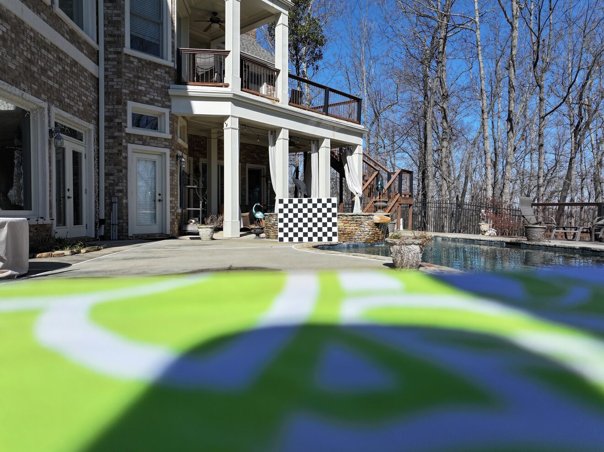
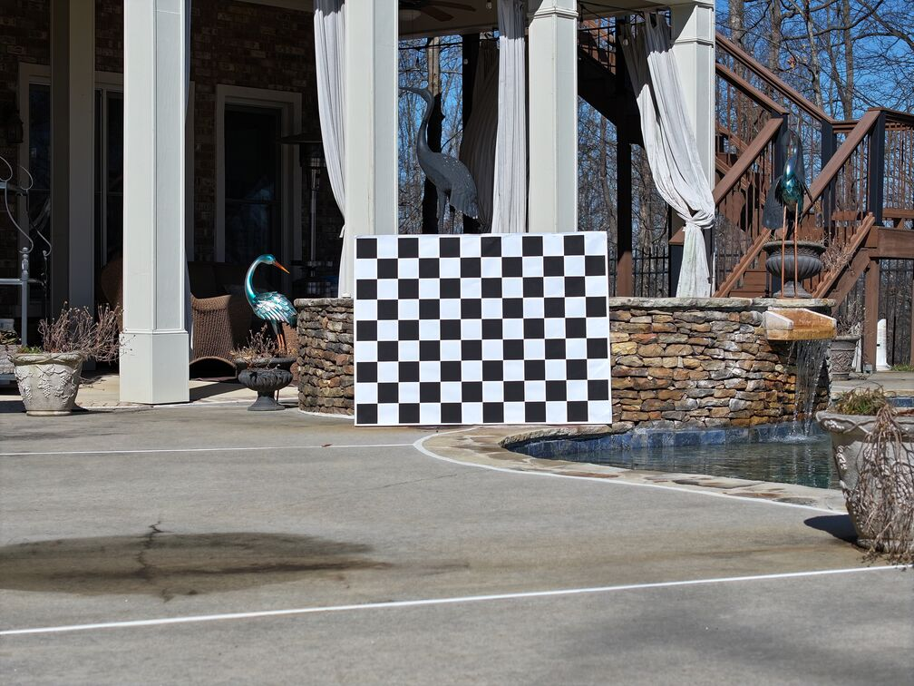

# Calculate Camera Skew

This document provides instructions on how to calibrate your drone cameras and use the [`calculate-camera-skew.py`](./calculate-camera-skew.py) script to compute the pitch and yaw misalignment between a wide-angle camera and a telephoto camera on the same drone camera gimbal.

## Table of Contents

- [Camera Calibration](#camera-calibration)
- [Setup and Image Capture](#setup-and-image-capture)
- [Using the Script](#using-the-script)
- [Optional Arguments](#optional-arguments)
- [Troubleshooting](#troubleshooting)

## Camera Calibration

Before running the skew calculation, each camera must be calibrated to obtain accurate intrinsic parameters (e.g., focal length, sensor dimensions) which are used for pixel angle calculations. To do this:

1. **Calibrate Each Camera:**
   - Use the [`camera-calibration.py`](./camera-calibration.py) script provided in this repository for the wide angle camera. Documentation for using this calibration script is available in [README.md](./README.md) of this repo.
   - Follow the instructions in its documentation to capture calibration images of a chessboard pattern with the wide angle camera.
   - The script will compute the camera's intrinsic parameters (which are used for calculating angle from a given pixel) and provide output for the camera in JSON format. Save this to a new file.
   - Switch the drone to capture images from its telephoto camera and repeat the calibration process for this camera.
       - on some drones this is done by selection of the desired camera within the ground control station software UI
       - on other drone models (such as the Parrot Anafi), it switches automatically from the wide angle to the telephoto camera at a certain zoom level
       - you can confirm which camera on the gimbal is currently active by using your finger to cover the wide angle camera.
   - make sure that you are at the minimum zoom level for each given camera to be calibrated and no additional digital zoom is applied.
       - additional digital zoom will negatively-affect the calculation accuracy of `camera-calibration.py`for intrinsic parameter calibration values.

For example, a JSON file for each the wide angle and 3x telephoto camera on the Mavic 3 Pro are formatted like this:

Mavic3Hasselblad.json
```json
{
    "makeModel": "hasselbladL2D-20C",
    "isThermal": false,
    "ccdWidthMMPerPixel": "17.902472/5280.0",
    "ccdHeightMMPerPixel": "13.357522/3956.0",
    "widthPixels": 5280,
    "heightPixels": 3956,
    "comment": "DJI Mavic 3 Main Hasselblad Camera",
    "lensType": "perspective",
    "radialR1": 0.0044647,
    "radialR2": -0.00549164,
    "radialR3": 0.0246166,
    "tangentialT1": -0.000468935,
    "tangentialT2": -0.000564484
}
```

Mavic3MediumTele.json
```json
{
    "makeModel": "djiFC4382",
    "isThermal": false,
    "ccdWidthMMPerPixel": "0.002146467050210994/1.0",
    "ccdHeightMMPerPixel": "0.0021372134436753163/1.0",
    "widthPixels": 4032,
    "heightPixels": 3024,
    "lensType": "perspective",
    "radialR1": "-0.2494834643930936",
    "radialR2": "1.8039776846375912",
    "radialR3": "-6.4360715619716755",
    "tangentialT1": "-0.0111020295182332",
    "tangentialT2": "-0.0027645598564520",
    "comment": "Mavic 3 Pro 3x Medium Tele Camera"
}
```

## Setup and Image Capture

Once you have a calibration JSON file for each camera, next you will capture an image from each camera to calculate their pitch and yaw misalignment (skew).

For reliable skew calculations, it is critical to ensure that the calibration setup remains fixed for both cameras:

1. **Positioning:**
   - Place both the drone and the calibration pattern poster in fixed positions.
   - Ensure that the calibration pattern is fully visible within the image frame of both the wide-angle and the telephoto cameras.

e.g. An image from a wide angle camera:


e.g. An image from the telephoto camera on the same drone camera gimbal:


Note: You can confirm which camera on the gimbal is currently active by using your finger to cover the wide angle camera.

2. **Calibration Pattern:**
   - The provided default calibration pattern (in the file [36in_x_48in_9col_12row_100mm_cv_poster.pdf](./36in_x_48in_9col_12row_100mm_cv_poster.pdf)) is a chessboard printed as a 36" x 48" poster with 100 mm squares.
   - If you use a calibration printout with different dimensions, adjust the optional parameters accordingly (see below).

## Using the Script

Once your cameras have been calibrated and the setup is complete, you can run the skew calculation script. The script processes two images along with their corresponding JSON calibration files to compute the pitch and yaw offset.

Open a terminal and run:

```bash
python3 calculate-camera-skew.py --image1 /path/to/wide-angle-image.jpg --image2 /path/to/telephoto-image.jpg --json1 /path/to/wide-angle-camera.json --json2 /path/to/telephoto-camera.json
```

The script will output the pitch and yaw values for each camera as well as the relative offset (misalignment) between them.

Here is an example of output from the script:

```bash
(camera-calibration) bobjoe@kusanagi:~/projects/camera-calibration$ python3 calculate-camera-skew.py --image1 /home/bobjoe/Pictures/2025-02-01-Mavic-3-Pro_sorted/Measure_Skew/DJI_20250201132122_0106_D.JPG --image2 /home/bobjoe/Pictures/2025-02-01-Mavic-3-Pro_sorted/Measure_Skew/DJI_20250201132117_0105_D.JPG --json1 Mavic3Hasselblad.json --json2 Mavic3MediumTele.json
Reference Camera (Image1): pitch = -0.827°, yaw = 0.783°
Telephoto Camera (Image2): pitch = -0.382°, yaw = 0.691°

Relative Offset (Telephoto vs. Reference):
Pitch Offset: 0.445°
Yaw Offset:   -0.092°
```

## Optional Arguments

If your calibration pattern differs from the default (a 36" x 48" poster with 100 mm squares), you can customize the chessboard parameters using the following optional arguments:

- `--square_size`: Size of one chessboard square in millimeters (default: `100`).
- `--num_rows`: Number of rows (squares) on the chessboard (default: `9`).
- `--num_cols`: Number of columns (squares) on the chessboard (default: `12`).

For example, if your chessboard has a different configuration, invoke the script as follows:

```bash
python3 calculate-camera-skew.py --image1 /path/to/wide-angle.jpg --image2 /path/to/telephoto.jpg --json1 /path/to/wide-angle.json --json2 /path/to/telephoto.json --square_size 80 --num_rows 8 --num_cols 10
```

## Troubleshooting

- **Chessboard Not Found:**
  Ensure that the calibration pattern is fully visible and in-focus in both images.
- **EXIF Errors:**
  Verify that the images contain the necessary EXIF data (focal length and digital zoom ratio). Certain file transfer apps strip EXIF metadata from drone images, make sure to obtain imagery from your drone via a method which does not strip this metadata.
- **Scaling and Zoom Issues:**
  The script automatically adjusts for scaled and digitally zoomed images by comparing the actual image width to the sensor’s full resolution (as defined in the JSON). Make sure that the JSON files accurately represent the camera's CCD dimensions.
