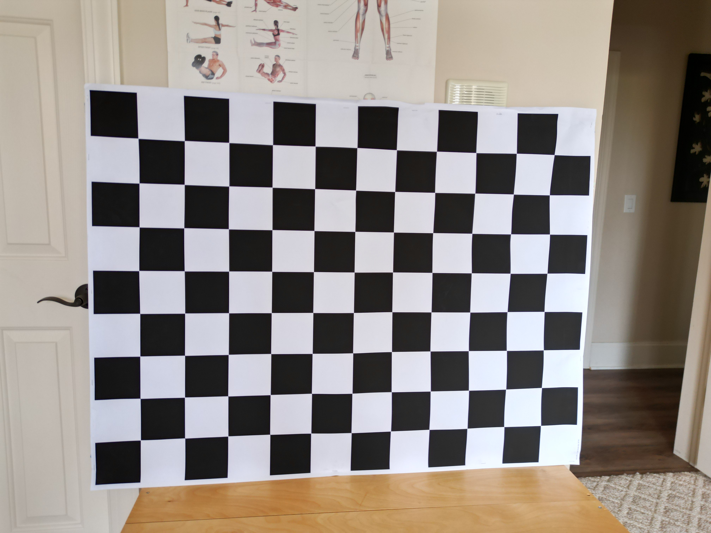

# Camera Calibration Script

## Overview
The Python script [`camera-calibration.py`](./camera-calibration.py) is designed for camera calibration using a chessboard pattern. It computes the camera's intrinsics matrix and distortion coefficients, which are essential for correcting lens distortion and calculating the pitch and yaw angle off from center for any given image pixel. The script then outputs the calibration data as an entry in [json](https://en.wikipedia.org/wiki/JSON) format suitable for inclusion in [OpenAthena's](https://github.com/Theta-Limited) [droneModels.json](https://github.com/Theta-Limited/DroneModels) calibration database.

This script does not yet support and will not work correctly for [fisheye camera lenses](https://en.wikipedia.org/wiki/Fisheye_lens).

Included in this repository is the file [36in_x_48in_9col_12row_100mm_cv_poster.pdf](./36in_x_48in_9col_12row_100mm_cv_poster.pdf), which contains a chessboard pattern with a square size of 100mm sized to print on a 36" x 48" poster. It is recommended to turn this poster sideways for taking pictures with the camera you wish to calibrate. Make sure to attach the poster to a rigid, flat surface such as a posterboard or large piece of cardboard. It is imperative that the squares on the poster pattern remain parallel to eachother and are not physically warped or distorted. 


You may also generate a pattern of a different size using this webpage:
https://calib.io/pages/camera-calibration-pattern-generator

Set the Target Type to `Checkerboard` and adjust width, height rows, columns and checker width as needed to fit your print format. Use these new values with the script as described below.



# Calculate Camera Skew

A separate script, [`calculate-camera-skew.py`](./calculate-camera-skew.py) is available in this repository for calculating the pitch and yaw angles for misalignment between two cameras on the same drone camera gimbal. Documentation on use of this script is available in [CALCULATE_SKEW.md](./CALCULATE_SKEW.md).


# Camera Calibration

## Taking Calibration Images

The number of calibration images you use and the way you take them are crucial for achieving accurate camera calibration. Here's some guidance:

### Number of Calibration Images

- **Minimum Recommended**: At least 10-20 images.
- **Optimal Range**: 20-50 images. More images generally provide better results, but beyond a certain point, the improvement becomes marginal.
- **Variability**: It's not just the number but the variety in the images that matters. More varied images lead to better calibration.

### Tips for Taking Calibration Images

1. **Set your camera to its minimum zoom level**
   - Set your camera to its minimum zoom (both digital and optical) for taking calibration images
   - Keep in mind that some drone camera gimbals (such as the Parrot Anafi) switch between different cameras at different zoom levels, for these each camera will need to be calibrated separately for best results

2. **Cover the Entire Field of View**:
   - Ensure that the chessboard is captured from different parts of the camera's field of view in various images. This includes corners and edges.
   - Avoid using only center-focused images.

3. **Vary the Orientation and Angle**:
   - Take pictures from various angles: some tilted up, down, left, right, and some rotated at slight angles.
   - This helps in accurately capturing the camera's lens distortions.

4. **Vary the Distance**:
   - Include shots from different distances – some close-up shots of the chessboard and some from farther away.
   - Ensure the chessboard is clearly visible and occupies a significant portion of the frame in each image.

5. **Avoid Covering the Black Squares**:
   - Be carefull that you do not cover any of the black squares if holding the calibration pattern by hand.
   - The calibration script looks for the corners of the black squares on the calibration pattern. If any are obstructed the algorithm will produce poor results

6. **Avoid Reflections and Shadows**:
   - Ensure consistent lighting and avoid strong shadows or reflections on the chessboard, as these can interfere with corner detection.

7. **Use the full sensor**:
   - Most cameras crop pixels from top and bottom of their 4:3 image sensor to make it fit in widescreen 16:9. Set your drone camera to 4:3 to ensure you get full coverage of the image sensor

8. **Ensure the Entire Chessboard is Visible**:
   - All four corners of the pattern should be in the frame for each image.

9. **Consistent Chessboard Orientation**:
   - While varying angles and distances, keep the orientation of the chessboard consistent (e.g., always keep the same corner or side of the chessboard in the same relative position).

10. **Use a Stable Chessboard Setup**:
    - The chessboard should be flat and rigid. Any bending or flexing can distort the pattern and affect accuracy.

### Post-processing the Images
- **Check for Clarity**: Before running the calibration, visually inspect the images to ensure that the chessboard and black square corners are clear, distinguishable, and un-obstructed. Delete images that don't meet these standards.

## Installation

### Requirements
- Python 3.x
- numpy
- opencv-python
- Pillow

Clone this project using git (or download as a zip file and extract it)
```
git clone https://github.com/Theta-Limited/camera-calibration.git
```

Enter the project directory, then install the necessary libraries using:
```bash
pip install -r requirements.txt # may be 'pip3' on some systems
```

## Usage

### Mandatory arguments

The script can be executed from the command line with the following arguments:
- `--image_dir`: The directory containing calibration images (default is the current working directory if not provided).
- `--square_size`: The size of one square on the chessboard, in millimeters.
- `--num_rows`: The total number of rows of squares on the chessboard (as counted normally).
- `--num_cols`: The total number of columns of squares on the chessboard (as counted normally).

### Optional arguments

The following arguments are optional and may not be needed in most cases:
- `--make`: Name of the manufacturer of the camera. Used only if this not available within image EXIF metadata
- `--model`: Model name of the camera. Used only if this is not available within image EXIF metadata
- `--focal_length`: Focal length (in mm) of the camera. Used only if this is not available within image EXIF metadata
- `--drone_comment`: Human-readable text for the comment field for your drone model. Entirely optional.

### Command Line Syntax
```bash
python3 camera-calibration.py --image_dir path/to/images --square_size 100 --num_rows 9 --num_cols 12
```

Alternatively, if you do not specify the `--image_dir`, the script will use the current working directory:
```bash
python3 camera-calibration.py --square_size 100 --num_rows 9 --num_cols 12
```

## Important Notes
- **Square Size**: Input the size of the physical chessboard squares in millimeters. Results will be inacurate if the true square size is different.
- **Rows and Columns**: Input the number of rows and columns as you would count them normally on the chessboard. The script internally converts these to the number of corners, as required by OpenCV for calibration.
- **Chessboard Pattern**: Ensure that the entire chessboard is visible in the calibration images, taken from various angles and distances.

## Output
The script outputs the camera matrix and distortion coefficients to:
- Standard output as text in the terminal.
- A file of the name makeMODEL.json, where the camera make and model name are obtained from image EXIF metadata

Both are formatted as a json entry in the same format used in the [droneModels.json](https://github.com/Theta-Limited/DroneModels) database.

E.g: here is what the ouptut json looks like for a DJI Mini 3 Pro:
```JSON
    {
      "makeModel": "djiFC3582",
      "isThermal": false,
      "ccdWidthMMPerPixel": "0.0023883764/1.0",
      "ccdHeightMMPerPixel": "0.002379536/1.0",
      "widthPixels": 4032,
      "heightPixels": 3024,
      "comment": "DJI Mini 3 Pro",
      "lensType": "perspective",
      "radialR1": 0.11416479395258083,
      "radialR2": -0.26230384345579,
      "radialR3": 0.22906477778853437,
      "tangentialT1": -0.004601610146546272,
      "tangentialT2": 0.0026292475166887
    }
```

## Contributing your calibration to OpenAthena

### Either:

* Email your calibration file generated by this script to  [support@theta.limited](mailto:support@theta.limited?subject=[GitHub]%20My%20Drone%20Calibration)
* create a pull request in the [DroneModels](https://github.com/Theta-Limited/DroneModels) repo to contribute your calibration to the OpenAthena project(s):

[https://github.com/Theta-Limited/DroneModels](https://github.com/Theta-Limited/DroneModels)

### Legal:

By making such a contribution of your drone's calibration data, you accept to the terms of Theta's [Contributor License Agreement](https://github.com/Theta-Limited/Contributor-License-Agreement)
